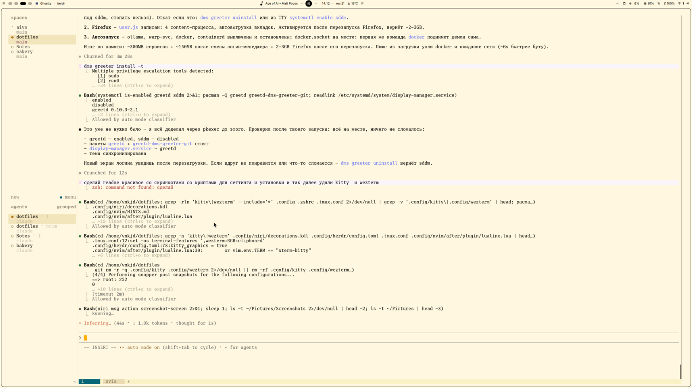
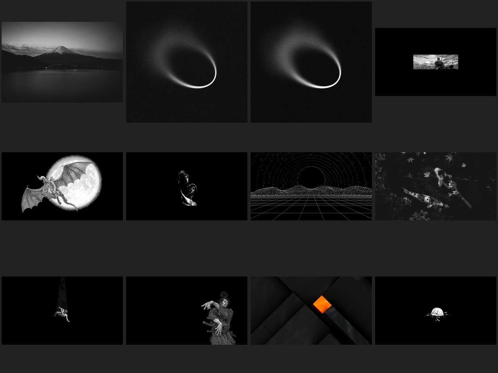

# dotfiles

CachyOS + [niri](https://github.com/YaLTeR/niri) + [DankMaterialShell](https://danklinux.com).
Монохромная AMOLED-тема с оранжевым акцентом, светлый и тёмный режимы — от логин-экрана до обоев.



## Что внутри

| Компонент | Выбор |
|---|---|
| WM | niri (scrollable tiling, Wayland) |
| Shell / бар | DankMaterialShell (quickshell), кастомная тема `amoled.json` |
| Логин | greetd + dms-greeter, тема синхронизирована с сессией |
| Терминал | ghostty (+ tmux, [herdr](https://herdr.dev) для агентов) |
| Редактор | neovim, свой монохромный colorscheme |
| Файлы | yazi (+ Thunar), тема под tmux-палитру |
| Агенты | Claude Code: настройки, скилы, hooks, herdr-плагины — всё в репо |

## Обои

Два набора под режимы темы: тёмный — AMOLED-монохром, светлый — duotone
«тушь на слоновой кости» (`#fff7df` — фон светлой темы). DMS переключает их
вместе с темой автоматически. Исходники — в `wallpapers/originals/`.

| Тёмные | Светлые |
|---|---|
|  |  |

Карусель — плагин [Wallpaper Carousel](https://github.com/motor-dev/wallpaperCarousel):
fullscreen 3D-выбор обоев, `Mod+T` / `Mod+W`.

## Установка

```sh
git clone <repo> ~/dotfiles
~/dotfiles/install.sh          # симлинки всех конфигов в $HOME
~/dotfiles/claude/install.sh   # плагины и MCP-серверы Claude Code
dms greeter install -t         # логин-экран DMS (greetd), опционально
```

`install.sh` идемпотентен: существующие не-симлинки не трогает, только предупреждает.

## Горячие клавиши (главное)

| Клавиши | Действие |
|---|---|
| `Mod+Return` | терминал |
| `Mod+Shift+T` | плавающий терминал |
| `Mod+D` | лаунчер (spotlight) |
| `Mod+T` / `Mod+W` | карусель обоев |
| `Mod+Ctrl+W` / `+Shift` | следующие / предыдущие обои |
| `Ctrl+h/j/k/l` в herdr | vim-aware навигация по panes (nvim получает клавишу сам) |

Полный список — `.config/niri/binds.kdl`.

## Детали

- **Тихие уведомления**: громкость звука DMS зажата до 10% через WirePlumber
  stream-restore; herdr играет свои mp3 (`.config/herdr/sounds/`), пережатые до 10%.
- **herdr vim-nav**: локальный плагин (`.config/herdr/plugins-local/vim-nav/`) —
  `ctrl+hjkl` идут в nvim, если он в фокусе, иначе двигают фокус panes.
- **Анимации niri**: глобальный `slowdown 0.6` — быстрее, но не мгновенно.
- **Claude Code**: `.claude/` (settings, commands, hooks, skills) и `.agents/`
  живут в репо, домашние пути — симлинки. `claude/install.sh` ставит плагины
  и MCP-серверы с нуля.
